# 实时渲染系统 — GPU 资源术语分层解析

> 本文档是「实时渲染系统」系列的补充专题，解决一个高频痛点：**显存、Buffer、Texture、SRV、Sampler、Mesh、贴图、体素、骨骼、动画……这些术语分属不同抽象层级，极易混为一谈**。本文用四条独立的"划分标准"将它们逐一归位，建立从硬件物理到美术资产的完整心智模型。
>
> 阅读前置：建议先浏览 [05-资源管理体系] 与 [10-现代图形API与GPU架构]，本文在二者之间起到术语"缝合"作用。

---

## 0. 为什么需要这篇文档

在图形学学习和引擎开发中，以下对话反复出现：

```
美术：  "这个角色的法线贴图怎么传到 shader 里？"
引擎：  "法线贴图是 Sampled Texture，绑成 SRV 就行。"
美术：  "SRV 是什么？跟显存有什么关系？"
引擎：  "……"
```

问题根源在于：**同一个概念在不同抽象层级有不同名字**，而文档和教程往往不加区分地混用。本文的核心思路是——先确认"我们在说哪个层级的事"，再展开术语。

---

## 1. 四层划分总览

所有 GPU 相关术语都可以归入以下四个抽象层级之一，此外还有一个**横切所有层**的第五维度——资源更新频率：

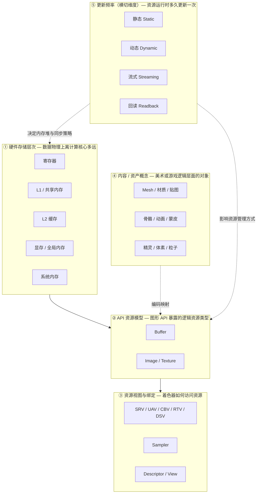

**一句话记忆**：

| 层级 | 回答的问题 | 典型术语 |
|------|-----------|---------|
| ① 硬件存储 | "数据物理上在哪里？" | 显存、L1、L2、寄存器 |
| ② API 资源 | "API 把数据抽象成了什么？" | Buffer、Texture |
| ③ 视图/绑定 | "着色器以什么方式访问？" | SRV、UAV、Sampler |
| ④ 内容资产 | "美术/游戏逻辑里叫什么？" | Mesh、贴图、骨骼、动画 |
| ⑤ 更新频率 | "运行时多久更新一次？" | 静态、动态、流式、回读 |

> **关键纪律**：讨论任何术语时，先问自己"它在哪一层？"——这能消除 90% 的混淆。

---

## 2. 第一层：硬件存储层次

### 2.1 存储层次全景

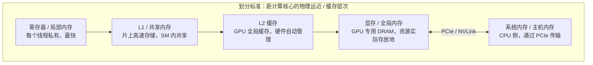

### 2.2 各层详解

| 层级 | 名称 | 管理方式 | 容量量级 | 延迟 | 典型用途 |
|------|------|---------|---------|------|---------|
| **寄存器** | Register / Local Memory | 硬件自动分配 | ~256KB/SM | ~1 cycle | 着色器局部变量 |
| **L1 / 共享内存** | L1 Cache / Shared Memory | L1 硬件自动；共享内存显式管理 | ~128KB/SM | ~30 cycles | 线程块间数据共享、规约 |
| **L2 缓存** | L2 Cache | 硬件自动管理 | ~6MB（因 GPU 而异） | ~200 cycles | 跨 SM 数据一致性 |
| **显存 / 全局内存** | VRAM / Global Memory | 开发者通过 API 显式分配 | 8~24 GB | ~400+ cycles | Buffer / Texture 实际存放地 |
| **系统内存** | System Memory | 操作系统管理 | 16~128 GB | PCIe 带宽限制 | 暂存待上传数据、回读数据 |

### 2.3 关键澄清

- **"全局内存" = "显存"**：CUDA 术语中的 `global memory` 就是 GPU 的设备内存（显存）。你通过 Vulkan/D3D 创建的所有 Buffer 和 Texture，最终都分配在这里。
- **L1 vs 共享内存**：在同一块物理 SRAM 上，一部分配置为硬件自动管理的 L1 缓存，另一部分配置为开发者显式控制的共享内存（Shared Memory）。两者物理相邻，但使用方式不同。
- **寄存器 ≠ 局部内存**：寄存器是硬件自动分配给线程的；当寄存器溢出（register spilling）时，数据会落到"局部内存"——物理上仍在显存中，速度很慢。

> **性能启示**：显存访问延迟是寄存器的 **400 倍以上**。优化 GPU 性能的本质就是减少全局内存访问、提高缓存命中率、利用共享内存做显式数据复用。

---

## 3. 第二层：API 资源模型

### 3.1 两大基本资源类型

现代图形 API（Vulkan / D3D12 / Metal）只暴露两种基础资源类型：

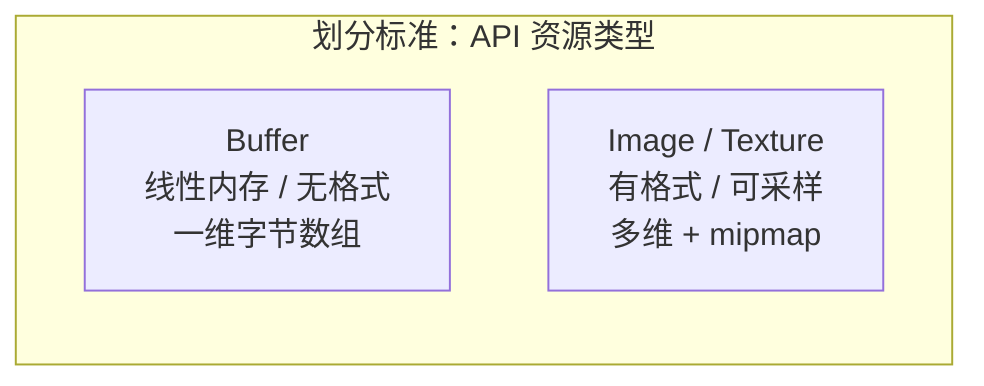

| 特性 | Buffer | Image / Texture |
|------|--------|----------------|
| **内存布局** | 线性（一维） | 可优化（tiled / swizzled） |
| **格式** | 无内置格式（原始字节） | 有像素格式（R8G8B8A8 等） |
| **采样/过滤** | 不支持 | 支持（双线性/三线性/各向异性） |
| **mipmap** | 无 | 支持 |
| **维度** | 一维 | 1D / 2D / 3D / Cube / Array |
| **典型用途** | 顶点、索引、常量、结构化数据 | 纹理、渲染目标、存储纹理 |

> **为什么只有两种？** 因为 GPU 硬件只需要区分两种内存访问模式：**线性寻址**（Buffer，按字节偏移）和 **空间寻址**（Texture，按坐标 + 采样器访问）。所有其他"资源类型"都是这两种的用途变体或视图。

### 3.2 Buffer 的派生用途

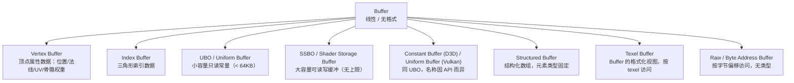

**Buffer 用途辨析**：

| 派生类型 | Vulkan 术语 | D3D12 术语 | 容量限制 | 读写性 | 典型场景 |
|---------|------------|-----------|---------|--------|---------|
| Vertex Buffer | Vertex Buffer | Vertex Buffer | 大 | GPU 只读 | 顶点数据 |
| Index Buffer | Index Buffer | Index Buffer | 大 | GPU 只读 | 索引数据 |
| Uniform Buffer | UBO (Uniform Buffer) | CBV (Constant Buffer View) | 小（~64KB） | GPU 只读 | 变换矩阵、材质参数 |
| Shader Storage Buffer | SSBO (Storage Buffer) | UAV (Unordered Access View) | 大 | GPU 读写 | 粒子系统、计算结果 |
| Texel Buffer | Texel Buffer View | SRV (Buffer + format) | 中 | GPU 只读 | 查找表、颜色渐变 |

### 3.3 Texture / Image 的派生用途

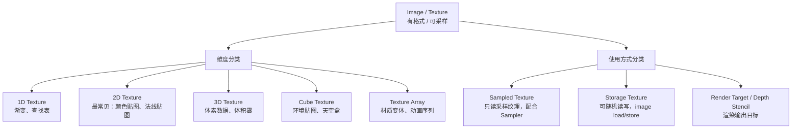

**Texture 用途辨析**：

| 派生类型 | 访问方式 | 读写性 | 配合对象 | 典型场景 |
|---------|---------|--------|---------|---------|
| Sampled Texture | 采样（sample） | 只读 | Sampler | 颜色贴图、法线贴图、环境贴图 |
| Storage Texture | imageLoad/imageStore | 读写 | 无需 Sampler | 计算着色器输出、随机写入 |
| Render Target | 光栅化输出 | 写入 | 深度/模板缓冲 | 帧缓冲、G-Buffer |
| Depth Stencil | 深度测试 | 读写 | 深度测试状态 | 阴影映射、深度预 pass |

### 3.4 3D Texture 特别说明

3D Texture 是 Texture 的**维度分类**，不是独立的资源类型。它和 2D Texture 共享 Image/Image 资源的基础设施，只是维度为 3。

| 对比项 | 2D Texture | 3D Texture |
|--------|-----------|------------|
| 坐标系 | (u, v) | (u, v, w) |
| 内存增长 | 随分辨率平方增长 | 随分辨率立方增长 |
| 典型用途 | 颜色贴图、法线贴图 | 体素数据、体积雾、3D 查找表 |
| 采样方式 | 2D 采样 + 过滤 | 3D 采样 + 三线性过滤 |

> **注意**：Texture Array ≠ 3D Texture。Texture Array 是多个独立 2D 纹理的数组（按 layer 索引），mipmap 各自独立；3D Texture 是单一连续的三维数据，mipmap 是三维金字塔。

---

## 4. 第三层：资源视图与绑定

### 4.1 视图——资源与管线的"接口"

资源本身（Buffer / Texture）是"一块内存 + 格式信息"。**视图（View）** 决定了"着色器以什么方式访问这块内存"。

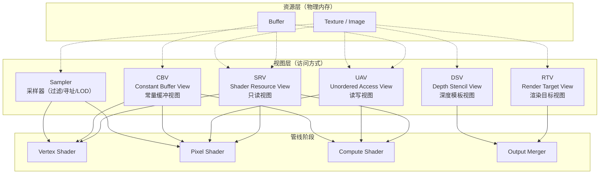

### 4.2 视图类型详解

| 视图类型 | 全称 | 作用 | 可绑定资源 | API 对应 |
|---------|------|------|-----------|---------|
| **SRV** | Shader Resource View | 只读资源访问 | Buffer / Texture | D3D12: SRV；Vulkan: Descriptor(type=SRV/UNIFORM) |
| **UAV** | Unordered Access View | 读写资源访问（需原子操作） | Buffer / Texture | D3D12: UAV；Vulkan: Descriptor(type=STORAGE) |
| **CBV** | Constant Buffer View | 常量缓冲访问 | Buffer | D3D12: CBV；Vulkan: Descriptor(type=UNIFORM) |
| **RTV** | Render Target View | 颜色渲染输出 | Texture | D3D12: RTV；Vulkan: ImageView(as color attachment) |
| **DSV** | Depth Stencil View | 深度/模板渲染输出 | Texture | D3D12: DSV；Vulkan: ImageView(as depth attachment) |
| **Sampler** | Sampler State | 采样参数（过滤、寻址、LOD） | 独立对象 | 所有现代 API |

### 4.3 视图与资源的关系

**一个资源可以创建多个视图**——这是理解视图的关键：

```
资源：一张 R8G8B8A8 的 2D Texture

    ├─ 创建 SRV（只读采样）  → 绑定到像素着色器，读取颜色
    ├─ 创建 UAV（读写）     → 绑定到计算着色器，修改像素
    ├─ 创建 RTV（渲染目标） → 作为帧缓冲的颜色附件
    └─ 创建 SRV（不同格式）  → 以 R32 形式重新解释数据
```

> **视图的本质**：视图 = 资源 + 格式 + 访问模式 + 子资源范围。同一个资源通过不同视图可以呈现完全不同的"面貌"。

### 4.4 Sampler 详解

Sampler 不是视图，而是一个**独立的参数对象**，描述如何对 Texture 进行采样：

| 采样参数 | 选项 | 说明 |
|---------|------|------|
| **过滤（Filter）** | Point / Linear / Anisotropic | 最近邻 / 双线性 / 各向异性 |
| **寻址（Address）** | Wrap / Mirror / Clamp / Border | 超出 [0,1] 时的处理方式 |
| **LOD Bias** | 浮点数 | 手动偏移 mipmap 层级选择 |
| **各向异性等级** | 1x ~ 16x | 各向异性过滤质量 |
| **比较模式** | CompareRefToTexture | 用于阴影采样（PCF） |

```
Sampled Texture（资源） + Sampler（采样参数） = 着色器中的一次纹理采样

// GLSL 示例
layout(binding=0) uniform sampler2D myTexture;  // Texture + Sampler 组合
vec4 color = texture(myTexture, uv);           // 采样
```

### 4.5 地址空间：UVA

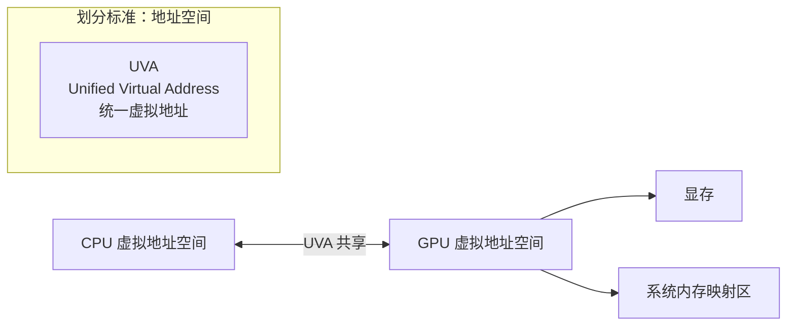

- **UVA（统一虚拟地址）**：让 CPU 和 GPU 共享同一虚拟地址空间，指针可以在两边通用。
- **UVA 不是资源类型**，也不是视图——它是地址空间层面的能力。
- CUDA 中的 `cudaMallocManaged`、Vulkan 中的 `VK_EXTERNAL_MEMORY_HANDLE_TYPE` 都依赖 UVA。
- **注意**：共享虚拟地址 ≠ 共享物理内存。UVA 下数据可能仍在显存或系统内存中，访问需要通过 PCIe 传输。

---

## 5. 第四层：内容 / 资产概念

### 5.1 内容层全景

美术和游戏设计师使用的术语，属于**应用层 / 内容层**，不直接对应底层 API 资源。它们是底层资源的"组合"或"语义包装"。

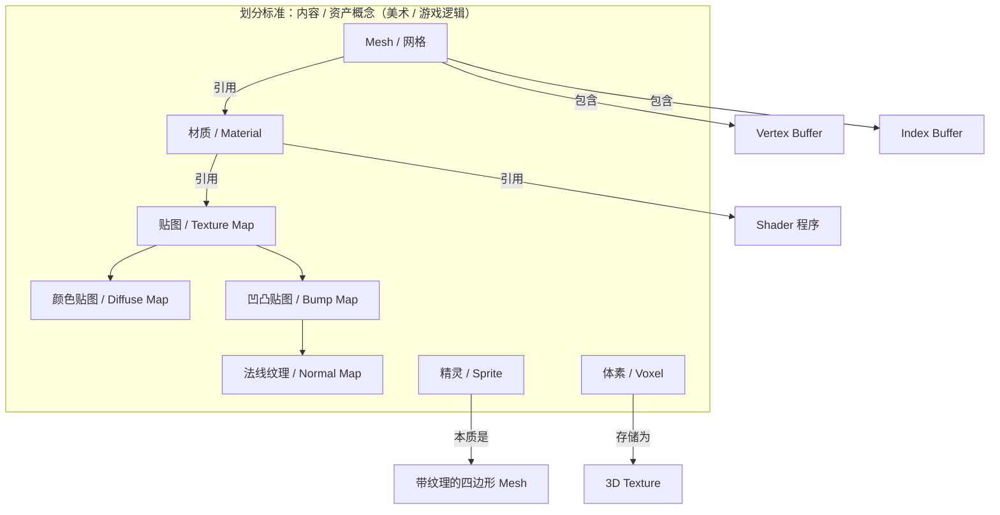

### 5.2 内容资产详解

| 美术术语 | 底层实质 | 构成 | 说明 |
|---------|---------|------|------|
| **模型 / Mesh** | Vertex Buffer + Index Buffer + 材质引用 | 顶点数据（位置、法线、UV、骨骼权重等）+ 三角形索引 + 材质 | 不是一个单一资源，是资源组合 |
| **材质 / Material** | Shader 程序 + UBO（参数）+ Texture 绑定 + Sampler | 着色器代码 + 参数集 + 纹理引用 | 材质是"配方"，不是"原料" |
| **贴图 / Texture Map** | Sampled Texture | 2D 纹理资源 | 美术层面的纹理资产 |
| **颜色贴图 / Diffuse / Albedo** | Sampled Texture | 2D RGBA 纹理 | 表面基础颜色 |
| **法线贴图 / Normal Map** | Sampled Texture | 2D 纹理（存储法线向量） | 扰动表面光照方向，制造凹凸感 |
| **凹凸贴图 / Bump Map** | Sampled Texture 或程序化 | 灰度高度图 | 扰动表面光照；法线贴图是其一种实现方式 |
| **精灵 / Sprite** | 两个三角形组成的四边形 + Texture | Vertex Buffer + Index Buffer + Sampled Texture | 本质是带纹理的 quad mesh |
| **体素 / Voxel** | 3D Texture 或结构化 Buffer | 三维像素阵列 | 体积数据存储，常用 3D 纹理采样 |

### 5.3 贴图家族辨析

贴图（Texture Map）是一个大类，下面有众多子类型。它们的底层都是 **Sampled Texture**，区别在于**存储的数据语义**和**着色器中的使用方式**：

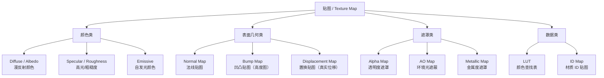

> **法线贴图 vs 凹凸贴图**：凹凸贴图（Bump Map）是更早的技术，存储灰度高度图；法线贴图（Normal Map）存储 RGB 法线向量，是凹凸贴图的升级实现。两者目的相同——在不增加几何体精度的情况下制造表面凹凸感。

---

## 6. 第五维度：资源更新频率——跨层的管理策略

前四层回答了"数据是什么、在哪里、怎么访问"。但在实际引擎运行中，还有一个**横切所有层**的关键维度：**资源在运行时多久被更新一次**。这个频率直接决定了资源应该放在哪种内存堆、采用何种同步策略，是性能优化的核心依据。

### 6.1 四类更新频率

```mermaid
flowchart TD
    subgraph FREQ["划分标准：资源更新频率"]
        STATIC["静态资源<br/>Static / Immutable<br/>加载时写入一次"]
        DYNAMIC["动态资源<br/>Dynamic / Mutable<br/>偶尔更新（秒级 / 事件触发）"]
        STREAM["流式资源<br/>Streaming / Per-frame<br/>每帧或高频更新"]
        READBACK["回读资源<br/>Readback<br/>GPU → CPU 回传"]
    end

    STATIC -->|"加载时写入一次，之后只读"| A1["静态模型 VB/IB"]
    STATIC --> A2["静态纹理 / 贴图"]
    STATIC --> A3["预烘焙动画纹理"]
    STATIC --> A4["地形高度图"]

    DYNAMIC -->|"偶尔更新（秒级 / 事件触发）"| B1["材质参数 UBO"]
    DYNAMIC --> B2["少量变化的 SSBO"]
    DYNAMIC --> B3["LUT / 查找表"]
    DYNAMIC --> B4["运行时修改的纹理"]

    STREAM -->|"每帧或高频更新（帧级）"| C1["骨骼矩阵 UBO / 纹理"]
    STREAM --> C2["粒子状态纹理 / SSBO"]
    STREAM --> C3["动态纹理 / 视频帧"]
    STREAM --> C4["每帧常量缓冲"]
    STREAM --> C5["临时渲染目标"]

    READBACK -->|"低频回读（结果 / 截图）"| D1["截图 / 视频捕获"]
    READBACK --> D2["遮挡查询结果"]
    READBACK --> D3["Compute Shader 计算结果"]
```

### 6.2 静态资源（Static / Immutable）

| 属性 | 说明 |
|------|------|
| **特征** | 加载时写入一次，之后 GPU 只读，CPU 不再修改 |
| **典型资源** | 静态模型顶点/索引缓冲、静态纹理、预烘焙动画纹理、地形数据 |
| **内存堆（D3D12）** | `D3D12_HEAP_TYPE_DEFAULT` — GPU 专用显存 |
| **内存属性（Vulkan）** | `DEVICE_LOCAL_BIT` — 设备本地内存，GPU 访问最快 |
| **VMA 策略** | `VMA_MEMORY_USAGE_GPU_ONLY` |
| **上传方式** | 通过 Staging Buffer（上传堆）中转，拷贝到设备本地内存后释放 |
| **同步开销** | 无需 CPU-GPU 同步，上传完成后 CPU 端即可释放暂存缓冲 |

**上传流程**：

```
CPU 系统内存                GPU 显存（Device Local）
                           ┌──────────────────┐
暂存缓冲 (Staging)    ──→   │  最终静态资源     │
(Host Visible)              │  (Device Local)   │
                            │  GPU 只读访问     │
                            └──────────────────┘
         ↑
    一次性拷贝后释放
```

> **优化要点**：静态资源追求最高 GPU 访问效率。一旦上传完成，数据驻留在显存中，CPU 不再接触，无需任何同步机制。

### 6.3 动态资源（Dynamic / Mutable）

| 属性 | 说明 |
|------|------|
| **特征** | 偶尔更新，频率较低（秒级、事件触发），如玩家换装、材质参数调整 |
| **典型资源** | 材质参数 UBO、LUT、运行时修改的少量纹理 |
| **内存堆（D3D12）** | `D3D12_HEAP_TYPE_UPLOAD` — 上传堆，CPU 可写、GPU 可读 |
| **内存属性（Vulkan）** | `HOST_VISIBLE_BIT \| HOST_COHERENT_BIT` — 主机可见且一致性 |
| **VMA 策略** | `VMA_MEMORY_USAGE_CPU_TO_GPU` |
| **访问方式** | 持久映射（persistent mapping），避免反复 Map/Unmap |
| **同步策略** | 需确保 CPU 写入时不与 GPU 正在读取的数据冲突 |

> **优化要点**：使用持久映射（Vulkan 中 `vkMapMemory` 一次，之后一直保持映射），避免每次更新都做 Map/Unmap。如果 GPU 可能正在读取旧数据，需要等待 GPU 完成或使用双缓冲。

### 6.4 流式资源（Streaming / Per-frame）

| 属性 | 说明 |
|------|------|
| **特征** | 每帧更新，甚至一帧内多次更新，是频率最高的一类 |
| **典型资源** | 骨骼矩阵、粒子状态、动态视频纹理、每帧常量缓冲、临时渲染目标 |
| **内存堆（D3D12）** | `D3D12_HEAP_TYPE_UPLOAD` + 环形缓冲 |
| **内存属性（Vulkan）** | `HOST_VISIBLE_BIT \| HOST_COHERENT_BIT` + Ring Buffer |
| **VMA 策略** | `VMA_MEMORY_USAGE_CPU_TO_GPU` + `VMA_POOL_CREATE_LINEAR_ALGORITHM_BIT` |
| **同步策略** | **多帧缓冲** + **围栏（Fence）** 轮换 |

**三种同步模式**：

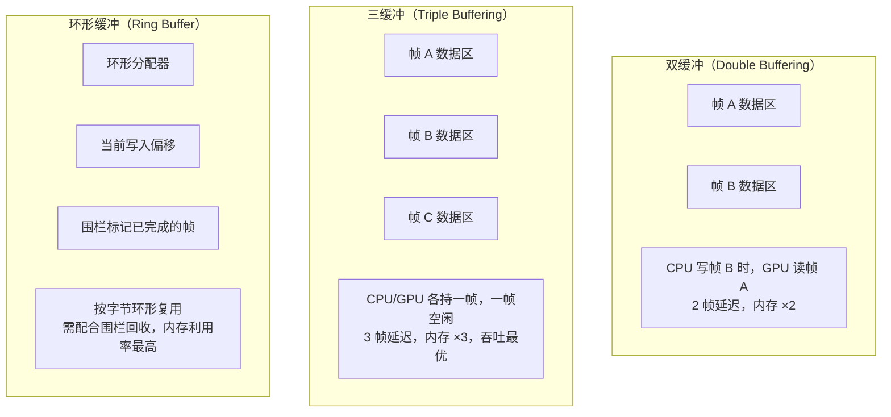

**环形缓冲工作原理**：

```
Ring Buffer 布局（假设 MAX_FRAMES_IN_FLIGHT = 2）

帧 N 写入:    [==== Frame N ====][          空闲          ]
帧 N+1 写入:  [==== Frame N ====][==== Frame N+1 ====][空 ]
帧 N+2 写入:  ← Fence 确认帧 N 已被 GPU 读完 → 可覆盖
               [==== Frame N+2 ====][==== Frame N+1 ====]
                                    ↑ 偏移回绕

关键：写指针不能追上 GPU 的读指针（否则数据竞争）
```

**Vulkan 环形缓冲伪代码**：

```cpp
// 每帧更新 UBO 的典型流程
struct FrameData {
    VkBuffer        uboBuffer;      // 从 Ring Buffer 中分配
    VkDeviceSize    uboOffset;      // 当前帧在 Ring Buffer 中的偏移
    VkFence         inFlightFence;  // GPU 完成围栏
};

void updateUniformBuffer(FrameData& frame, const CameraData& camData) {
    // 1. 等待 GPU 完成上一帧（围栏）
    vkWaitForFences(device, 1, &frame.inFlightFence, VK_TRUE, UINT64_MAX);
    vkResetFences(device, 1, &frame.inFlightFence);

    // 2. 从 Ring Buffer 分配当前帧的 UBO 区域
    void* mapped;
    vmaMapMemory(allocator, ringBufferAllocation, &mapped);
    memcpy((uint8_t*)mapped + frame.uboOffset, &camData, sizeof(camData));
    vmaUnmapMemory(allocator, ringBufferAllocation);

    // 3. 提交命令缓冲，GPU 完成后触发围栏
    //    下一帧回来时，步骤 1 会等待这个围栏
    vkQueueSubmit(graphicsQueue, 1, &submitInfo, frame.inFlightFence);
}
```

**特殊案例——GPU 内部更新的流式资源**：

粒子状态纹理、骨骼矩阵纹理等可通过 Compute Shader 在 GPU 内部直接更新，不经过 CPU 传输：

```
传统 CPU → GPU 流式：
  CPU 计算骨骼矩阵 → 更新 UBO/SSBO → GPU 读取
  (每帧 CPU-GPU 传输，有同步开销)

GPU 内部流式（GPU-Driven）：
  Compute Shader 计算骨骼矩阵 → 写入 SSBO → 顶点着色器直接读取
  (零 CPU 传输，仅 GPU 内部屏障同步)
```

> **优化要点**：流式资源追求最低 CPU-GPU 同步开销。现代引擎倾向于将更多流式更新迁移到 GPU 内部（Compute Shader 驱动），消除 CPU→GPU 传输瓶颈。

### 6.5 回读资源（Readback）

| 属性 | 说明 |
|------|------|
| **特征** | 数据从 GPU 传回 CPU，频率低（查询结果、截图、计算中间结果） |
| **典型资源** | 遮挡查询缓冲、截图缓冲、Compute Shader 输出 |
| **内存堆（D3D12）** | `D3D12_HEAP_TYPE_READBACK` — CPU 可读、GPU 可写 |
| **内存属性（Vulkan）** | `HOST_VISIBLE_BIT \| HOST_COHERENT_BIT`（GPU 写入后 CPU 可读） |
| **VMA 策略** | `VMA_MEMORY_USAGE_GPU_TO_CPU` |
| **同步策略** | **异步回读**，延迟若干帧读取，避免 stall |

**回读的危险——流水线阻塞**：

```
❌ 同步回读（立即读取）：
  GPU 提交命令 ──→ vkQueueWaitIdle() ──→ CPU 读取结果
                    ↑ 全流水线停顿！帧率暴跌

✅ 异步回读（延迟读取）：
  帧 N:  GPU 写入回读缓冲 → 记录围栏
  帧 N+2: CPU 等待帧 N 的围栏 → 读取结果（此时 GPU 早已完成）
          ↑ 不阻塞当前帧的渲染
```

> **优化要点**：回读是唯一从 GPU→CPU 方向的数据传输。回读缓冲放在 Readback 堆中（CPU 可读），但绝不能频繁同步等待——应使用围栏延迟 2~3 帧后再读取。

### 6.6 更新频率 × 四层模型交叉表

这个交叉表展示了更新频率如何横切前四层抽象：

| 更新频率 | ① 硬件存储 | ② API 资源 | ③ 视图/绑定 | ④ 内容资产 |
|---------|-----------|-----------|------------|-----------|
| **静态** | Device Local（显存） | VB/IB/静态 Texture | SRV（只读） | 静态模型、地形、预烘焙纹理 |
| **动态** | Host Visible（上传堆） | UBO/LUT/小 Texture | CBV/SRV | 材质参数、查找表 |
| **流式（CPU→GPU）** | Host Visible + Ring Buffer | UBO/SSBO/小 Texture | CBV/UAV | 骨骼矩阵、每帧常量、视频帧 |
| **流式（GPU 内部）** | Device Local | SSBO/Storage Texture | UAV | 粒子状态、动态渲染目标、GPU 蒙皮 |
| **回读** | Readback Heap | Buffer | 间接读取 | 截图、查询结果、计算输出 |

### 6.7 内存堆速查表

| D3D12 堆类型 | Vulkan 内存属性 | VMA 用法 | CPU 访问 | GPU 访问 | 典型用途 |
|-------------|---------------|---------|---------|---------|---------|
| `DEFAULT` | `DEVICE_LOCAL` | `GPU_ONLY` | 不可 | 最快 | 静态资源、GPU 内部流式 |
| `UPLOAD` | `HOST_VISIBLE \| HOST_COHERENT` | `CPU_TO_GPU` | 可写 | 可读（较慢） | 动态/流式（CPU→GPU） |
| `READBACK` | `HOST_VISIBLE \| HOST_COHERENT` | `GPU_TO_CPU` | 可读 | 可写（较慢） | 回读 |
| `CUSTOM`（GPU Upload） | `DEVICE_LOCAL \| HOST_VISIBLE` | `CPU_TO_GPU`（特殊配置） | 可写 | 快 | 小量高频上传（需 NVIDIA BAR 支持） |

> **核心原则**：更新频率决定了资源应放在哪种内存堆、采用何种同步机制。静态资源追求最高 GPU 访问效率（Device Local），流式资源追求最低 CPU-GPU 同步开销（Ring Buffer + Fence），回读资源则需避免阻塞渲染流水线（异步延迟读取）。

---

## 7. 骨骼与动画——最容易"跨层"的概念

### 6.1 核心结论

> **骨骼和动画不属于底层图形 API 的资源类型（Buffer/Texture），它们属于更高层的内容 / 游戏逻辑 / 场景图层。** 它们的数据最终必须被编码为 Buffer 或 Texture，才能被 GPU 使用。

### 6.2 内容层 → API 资源层映射

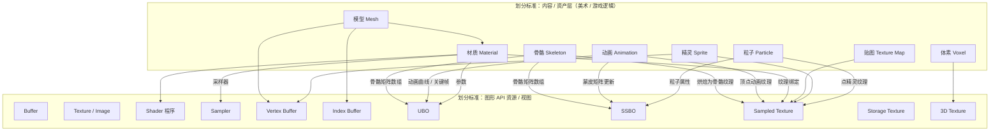

### 6.3 骨骼与动画的本质

| 术语 | 实质 | 数据结构 | 在 GPU 中如何存储/访问 |
|------|------|---------|----------------------|
| **骨骼 Skeleton** | 层级变换节点树（bone hierarchy），每个骨骼有局部变换和全局变换 | 树结构 + 4×4 矩阵数组 | 每帧计算出的骨骼矩阵数组存入 **UBO / SSBO**，或烘焙为 **骨骼纹理** 供着色器采样 |
| **动画 Animation** | 随时间变化的骨骼变换或顶点变形数据 | 关键帧序列 + 插值曲线 | 关键帧数据在 CPU 侧插值后更新 UBO/SSBO；或预烘焙为 **顶点动画纹理**（VAT）在顶点着色器中采样 |
| **蒙皮 Skinning** | 顶点包含骨骼索引和权重，通过骨骼矩阵混合顶点位置 | 顶点属性（骨骼索引+权重）+ 骨骼矩阵 | 顶点属性存入 **Vertex Buffer**，骨骼矩阵来自 UBO/SSBO/纹理 |

### 6.4 蒙皮着色器中的数据流

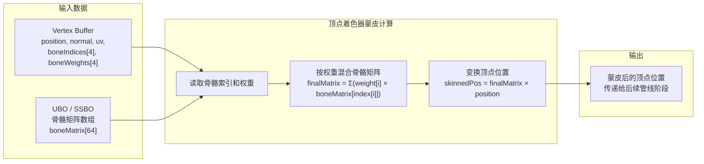

**伪代码示例**：

```glsl
// 顶点着色器中的蒙皮计算
layout(location = 0) in vec3 inPosition;
layout(location = 4) in ivec4 inBoneIndices;   // 骨骼索引（4 个）
layout(location = 5) in vec4 inBoneWeights;     // 骨骼权重（4 个，和为 1）

layout(binding = 0) uniform BoneData {
    mat4 boneMatrices[64];  // 骨骼矩阵数组（来自 UBO 或 SSBO）
};

void main() {
    // 按权重混合 4 根骨骼的矩阵
    mat4 skinMatrix =
        inBoneWeights[0] * boneMatrices[inBoneIndices[0]] +
        inBoneWeights[1] * boneMatrices[inBoneIndices[1]] +
        inBoneWeights[2] * boneMatrices[inBoneIndices[2]] +
        inBoneWeights[3] * boneMatrices[inBoneIndices[3]];

    // 用混合后的矩阵变换顶点位置
    vec4 skinnedPosition = skinMatrix * vec4(inPosition, 1.0);
    gl_Position = projView * modelMatrix * skinnedPosition;
}
```

### 6.5 骨骼矩阵存储方式对比

| 存储方式 | 资源类型 | 优点 | 缺点 | 适用场景 |
|---------|---------|------|------|---------|
| **UBO** | Uniform Buffer | 访问快、兼容性好 | 有容量限制（~64KB），约能存 ~400 个矩阵 | 骨骼数较少（<100） |
| **SSBO** | Shader Storage Buffer | 无容量限制、可读写 | 略慢于 UBO | 大量骨骼、GPU 蒙皮 |
| **骨骼纹理** | Sampled Texture | 利用纹理缓存、无容量限制 | 需要额外采样器 | 超大量骨骼、兼容旧硬件 |

> **选择建议**：现代引擎推荐 SSBO 存储骨骼矩阵——容量不受限，且支持 GPU Compute 更新矩阵后直接在着色器中读取，避免 CPU→GPU 传输。

---

## 8. 术语速查表（完整版）

### 8.1 按层级分类

| 术语 | 层级 | 类别 | 简要解释 |
|------|------|------|---------|
| 显存 | ① | 硬件存储 | GPU 专用 DRAM，资源实际存放地 |
| L1 / 共享内存 | ① | 硬件存储 | 片上高速缓存 / 可显式管理的共享内存 |
| L2 缓存 | ① | 硬件存储 | GPU 全局缓存，硬件自动管理 |
| 全局内存 | ① | 硬件存储 | CUDA 中 global memory，即显存/设备内存 |
| 寄存器 | ① | 硬件存储 | 最靠近计算核心的存储，线程私有 |
| Buffer | ② | API 资源 | 线性、无格式内存 |
| Image / Texture | ② | API 资源 | 有格式、可采样、可过滤的多维资源 |
| Vertex Buffer | ② | Buffer 用途 | 顶点属性数据缓冲 |
| Index Buffer | ② | Buffer 用途 | 索引数据缓冲 |
| UBO | ② | Buffer 用途 | 小容量只读常量缓冲 |
| SSBO | ② | Buffer 用途 | 大容量可读写缓冲 |
| Texel Buffer | ② | Buffer 视图 | 缓冲的格式化视图，按 texel 访问 |
| Sampled Texture | ② | Texture 用途 | 只读采样纹理，配合 Sampler |
| Storage Texture | ② | Texture 用途 | 可随机读写纹理，image load/store |
| 3D Texture | ② | Texture 维度 | 三维纹理，常用于体素 |
| SRV | ③ | 视图/绑定 | D3D 只读资源视图 |
| UAV | ③ | 视图/绑定 | D3D 读写资源视图 |
| CBV | ③ | 视图/绑定 | D3D 常量缓冲视图 |
| RTV / DSV | ③ | 视图/绑定 | 渲染目标视图 / 深度模板视图 |
| Sampler | ③ | 视图/绑定 | 采样参数对象：过滤、寻址、LOD |
| UVA | ③ | 地址空间 | 统一虚拟地址，CPU/GPU 共享地址空间 |
| Mesh / 网格 | ④ | 内容资产 | 顶点 + 索引 + 材质组成的网格 |
| 材质 / Material | ④ | 内容资产 | Shader + 参数 + 纹理绑定的组合 |
| 贴图 / Texture Map | ④ | 内容资产 | 映射到模型表面的纹理图 |
| 法线纹理 | ④ | 内容资产 | 存储法线向量的纹理 |
| 凹凸贴图 | ④ | 内容资产 | 扰动表面光照的贴图，法线贴图是其中一种 |
| 精灵 / Sprite | ④ | 内容资产 | 2D 纹理四边形渲染对象 |
| 体素 / Voxel | ④ | 内容资产 | 体积像素，通常存为 3D Texture |
| 粒子 / Particle | ④ | 内容资产 | 点精灵或 billboard，属性存于 SSBO |
| 骨骼 / Skeleton | ④ | 内容资产 | 变换层级树 + 矩阵数组 |
| 动画 / Animation | ④ | 内容资产 | 随时间变化的变换/顶点变形序列 |
| 蒙皮 / Skinning | ④ | 内容资产 | 顶点按骨骼权重混合的变形过程 |
| 静态资源 | ⑤ | 更新频率 | 加载时写入一次，之后只读 |
| 动态资源 | ⑤ | 更新频率 | 偶尔更新（秒级 / 事件触发） |
| 流式资源 | ⑤ | 更新频率 | 每帧或高频更新（帧级） |
| 回读资源 | ⑤ | 更新频率 | GPU → CPU 低频回传 |
| Ring Buffer | ⑤ | 同步策略 | 环形缓冲，配合围栏复用内存 |
| Staging Buffer | ⑤ | 上传机制 | 暂存缓冲，CPU→GPU 中转后释放 |

### 8.2 跨层映射速查

| 美术术语 | → | 底层资源 | → | 视图/绑定 |
|---------|---|---------|---|---------|
| 模型 Mesh | → | Vertex Buffer + Index Buffer | → | 直接绑定（IA 阶段） |
| 材质参数 | → | Buffer (UBO) | → | CBV / Descriptor |
| 颜色贴图 | → | 2D Texture | → | SRV + Sampler |
| 法线贴图 | → | 2D Texture | → | SRV + Sampler |
| 渲染目标 | → | 2D Texture | → | RTV |
| 深度缓冲 | → | 2D Texture | → | DSV |
| 骨骼矩阵 | → | Buffer (UBO/SSBO) 或 Texture | → | CBV/UAV 或 SRV |
| 粒子数据 | → | Buffer (SSBO) | → | UAV |
| 体素数据 | → | 3D Texture | → | SRV 或 Storage Image |

---

## 9. 常见混淆辨析

### 9.1 "贴图"和"纹理"是同一个东西吗？

**是的，在底层 API 层面完全相同。** "贴图"（Texture Map）是美术/内容层的叫法，"纹理"（Texture）是 API 层的叫法。一张颜色贴图在 GPU 中就是一个 Sampled Texture。

### 9.2 "材质"和"贴图"的区别？

| | 材质 (Material) | 贴图 (Texture Map) |
|---|---|---|
| **层级** | 内容资产（组合） | 内容资产（单一） / API 资源 |
| **构成** | Shader + 参数 + 多张贴图 + Sampler | 一张纹理图片 |
| **类比** | 菜谱 | 食材 |

一个材质可以引用多张贴图（颜色贴图、法线贴图、粗糙度贴图等），而一张贴图只是材质的一个组成部分。

### 9.3 "UBO"和"SSBO"什么时候用哪个？

| 场景 | 推荐 | 原因 |
|------|------|------|
| 变换矩阵（MVP） | UBO | 数据量小（<256B）、只读、高频访问 |
| 材质参数 | UBO | 数据量小、只读 |
| 骨骼矩阵（<100根骨骼） | UBO | 数据量适中、只读 |
| 骨骼矩阵（>100根骨骼） | SSBO | 超出 UBO 容量限制 |
| 粒子系统数据 | SSBO | 数据量大、需要 GPU 读写 |
| 计算着色器输出 | SSBO | 需要 GPU 读写、无容量限制 |

### 9.4 "Storage Texture"和"Render Target"的区别？

| | Storage Texture | Render Target |
|---|---|---|
| **写入方式** | 着色器中 `imageStore()` 随机坐标写入 | 光栅化管线输出（OM 阶段） |
| **访问粒度** | 任意像素，可随机访问 | 当前光栅化覆盖的像素 |
| **读写性** | 可读可写 | 主要写入（可配合 SRV 读取） |
| **典型场景** | 计算着色器输出、随机写入 | 帧缓冲、G-Buffer |

### 9.5 "SRV"和"Sampled Texture"的区别？

**SRV 是 D3D 的视图概念，Sampled Texture 是资源用途概念。** 一张 Sampled Texture 在 D3D 中通过创建 SRV 来绑定到着色器。它们是同一件事在不同视角下的称呼。

```
Texture（资源） → 创建 SRV（视图） → 绑定到着色器 → 以 Sampled Texture 方式使用
```

### 9.6 "静态资源"和"不可变资源"是同一个概念吗？

**是的，基本同义。** D3D11 时代有 `D3D11_USAGE_IMMUTABLE`，Vulkan 中没有专门标记，而是通过内存堆选择（`DEVICE_LOCAL`）+ 上传后不映射来体现。现代 API 不再提供"不可变"标记，而是由开发者通过内存放置策略和更新行为来隐式保证。

### 9.7 流式资源为什么要用 Ring Buffer 而不是直接 Map/Unmap？

| 方式 | 问题 |
|------|------|
| **每帧 Map/Unmap** | 驱动内部可能分配新内存或加锁，开销不可控 |
| **持久映射 + 无同步** | CPU 写入可能追上 GPU 读取，数据竞争 |
| **持久映射 + Ring Buffer + Fence** | 按 MAX_FRAMES_IN_FLIGHT 分区，围栏保证 GPU 读完才覆盖，开销可控且零 stall |

---

## 10. 四层关系总结

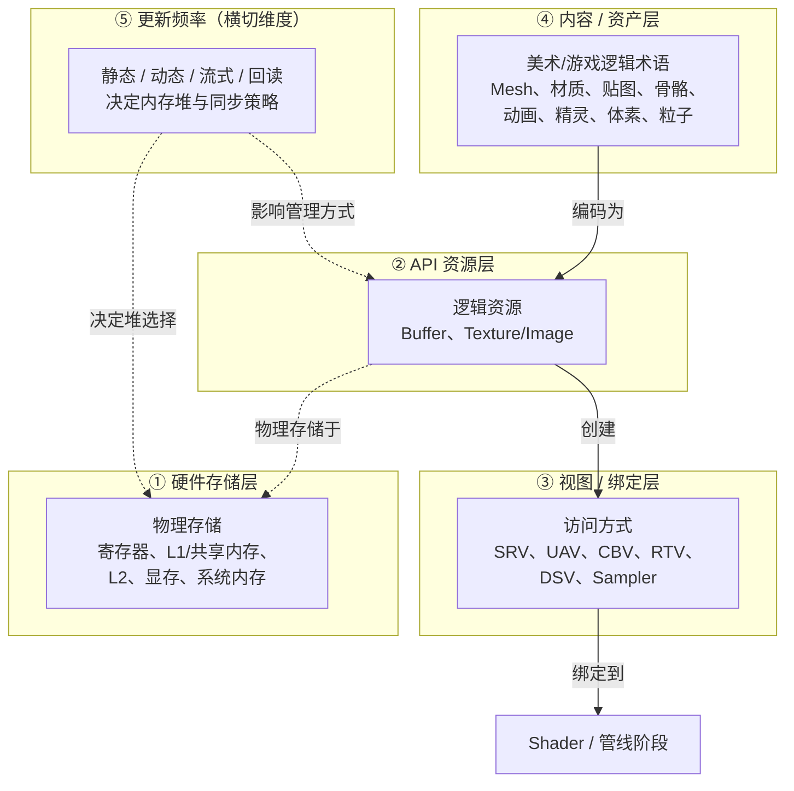

**核心结论**：

1. **L1/L2/显存** 是物理存储——回答"数据在哪里"。
2. **Buffer/Texture** 是 API 资源——回答"数据被抽象成了什么"。
3. **SRV/UAV/Sampler** 是访问方式——回答"着色器怎么访问数据"。
4. **Mesh/精灵/贴图/体素/骨骼/动画** 是内容概念——回答"美术/游戏逻辑里叫什么"。
5. **静态/动态/流式/回读** 是更新频率——回答"运行时多久更新一次"，横切前四层，决定内存堆与同步策略。

骨骼和动画是**应用层数据结构**，不是图形 API 资源。它们被编码为 Buffer（UBO/SSBO）或 Texture 后，才能在着色器中使用。美术家熟悉的"模型、材质、贴图"等术语，最终都映射到 Vertex Buffer、Index Buffer、Texture、Shader、Sampler 等底层资源。

> **一句话**：先分清层级，再讨论术语——这是避免图形学概念混乱的最有效方法。

---

## 附录 A：各 API 术语对照表

| 概念 | Vulkan | D3D12 | Metal | OpenGL |
|------|--------|-------|-------|--------|
| Buffer | Buffer | Buffer | Buffer | Buffer Object |
| Texture | Image | Texture | Texture | Texture Object |
| 只读视图 | Descriptor (SAMPLED_IMAGE) | SRV | Texture View | 绑定到纹理单元 |
| 读写视图 | Descriptor (STORAGE_IMAGE) | UAV | Texture View (usage: shader-write) | Image Binding |
| 常量缓冲 | Descriptor (UNIFORM_BUFFER) | CBV | Buffer (Uniform) | UBO |
| 可读写缓冲 | Descriptor (STORAGE_BUFFER) | UAV (Structured Buffer) | Buffer (usage: shader) | SSBO |
| 采样器 | Sampler | Sampler State | Sampler State | Sampler Object |
| 渲染目标 | ImageView (color attachment) | RTV | Texture (usage: render target) | FBO attachment |
| 深度模板 | ImageView (depth attachment) | DSV | Texture (usage: depth) | FBO attachment |

## 附录 B：骨骼动画术语对照

| 概念 | 常见别名 | 说明 |
|------|---------|------|
| Skeleton | 骨骼 / 骨架 / Rig | 骨骼层级结构 |
| Bone | 骨骼 / 骨头 | 骨骼树中的一个节点 |
| Joint | 关节 | 骨骼连接点，与 Bone 常混用 |
| Skin / Skinning | 蒙皮 / 蒙皮绑定 | 顶点与骨骼的绑定过程 |
| Weight | 权重 | 顶点受骨骼影响的程度 |
| Rigging | 绑定 / 装备 | 为模型设置骨骼并蒙皮的过程 |
| Animation Clip | 动画片段 / 动画剪辑 | 一段完整的骨骼动画数据 |
| Keyframe | 关键帧 | 动画中记录变换的离散时间点 |
| Blend Shape | 混合变形 / Morph Target | 顶点级动画，常用于面部表情 |

## 附录 C：内存堆与更新频率对照

| 更新频率 | D3D12 堆类型 | Vulkan 内存属性 | VMA 用法 | 典型资源 | 同步策略 |
|---------|-------------|---------------|---------|---------|---------|
| 静态（加载时） | `DEFAULT` | `DEVICE_LOCAL` | `GPU_ONLY` | 静态 VB/IB、静态纹理 | 无需同步 |
| 动态（偶尔） | `UPLOAD` | `HOST_VISIBLE \| HOST_COHERENT` | `CPU_TO_GPU` | 材质 UBO、LUT | 持久映射，注意冲突 |
| 流式（每帧 CPU→GPU） | `UPLOAD` + Ring Buffer | `HOST_VISIBLE \| HOST_COHERENT` | `CPU_TO_GPU` + Ring | 骨骼矩阵、粒子状态、常量缓冲 | 多帧缓冲 / 围栏 |
| 流式（GPU 内部） | `DEFAULT` | `DEVICE_LOCAL` | `GPU_ONLY` | 粒子纹理、动态渲染目标 | GPU 内部同步（屏障） |
| 回读（低频） | `READBACK` | `HOST_VISIBLE \| HOST_COHERENT` | `GPU_TO_CPU` | 截图、查询结果 | 异步回读，延迟读取 |
| 高频小量上传（可选） | `CUSTOM` | `DEVICE_LOCAL \| HOST_VISIBLE` | `CPU_TO_GPU`（特殊） | 高频常量缓冲 | 需要 BAR 支持 |

---

*上一篇：[11-实时渲染产业演进史](11-实时渲染产业演进史.md) | 下一篇：[13-UE5.8的RDG资源与RHI资源](13-UE5.8的RDG资源与RHI资源.md)*

> **注意**：`DEVICE_LOCAL | HOST_VISIBLE` 组合需要 NVIDIA Resizable BAR 或 AMD Smart Access Memory 支持，才能让 CPU 直接写入设备本地内存，避免 Staging Buffer 中转。
