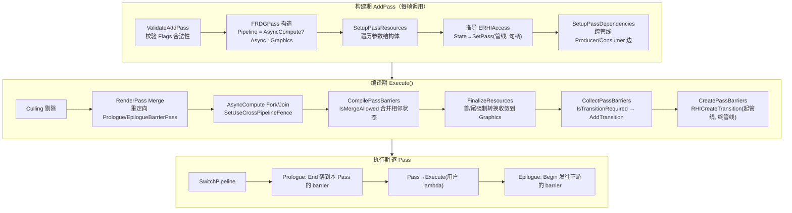
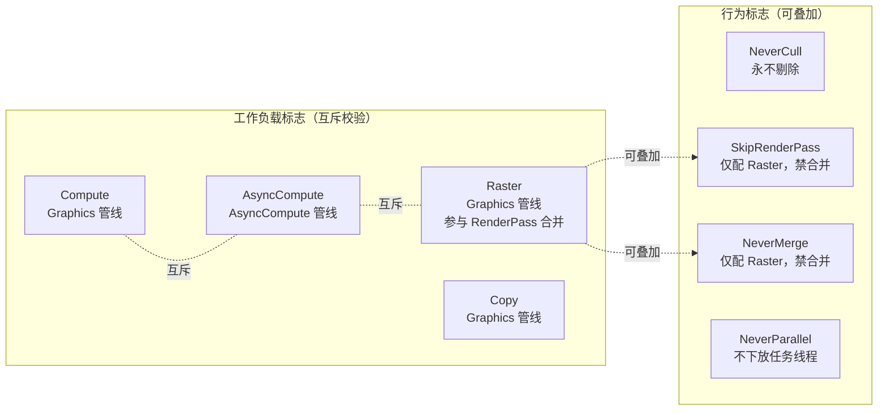
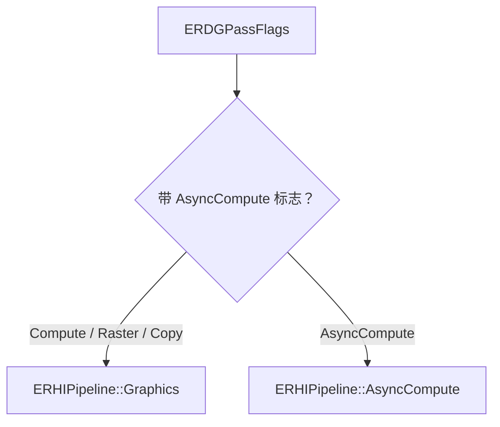
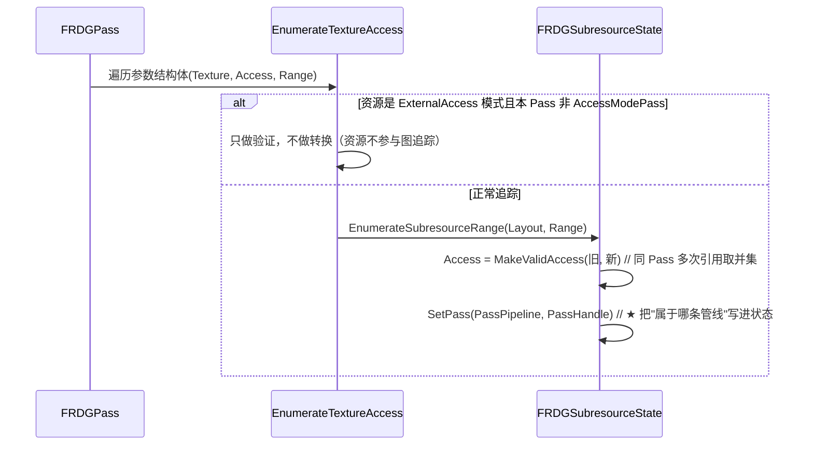
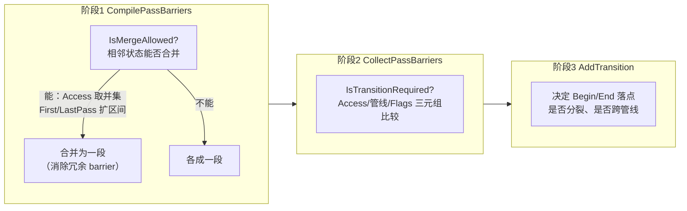
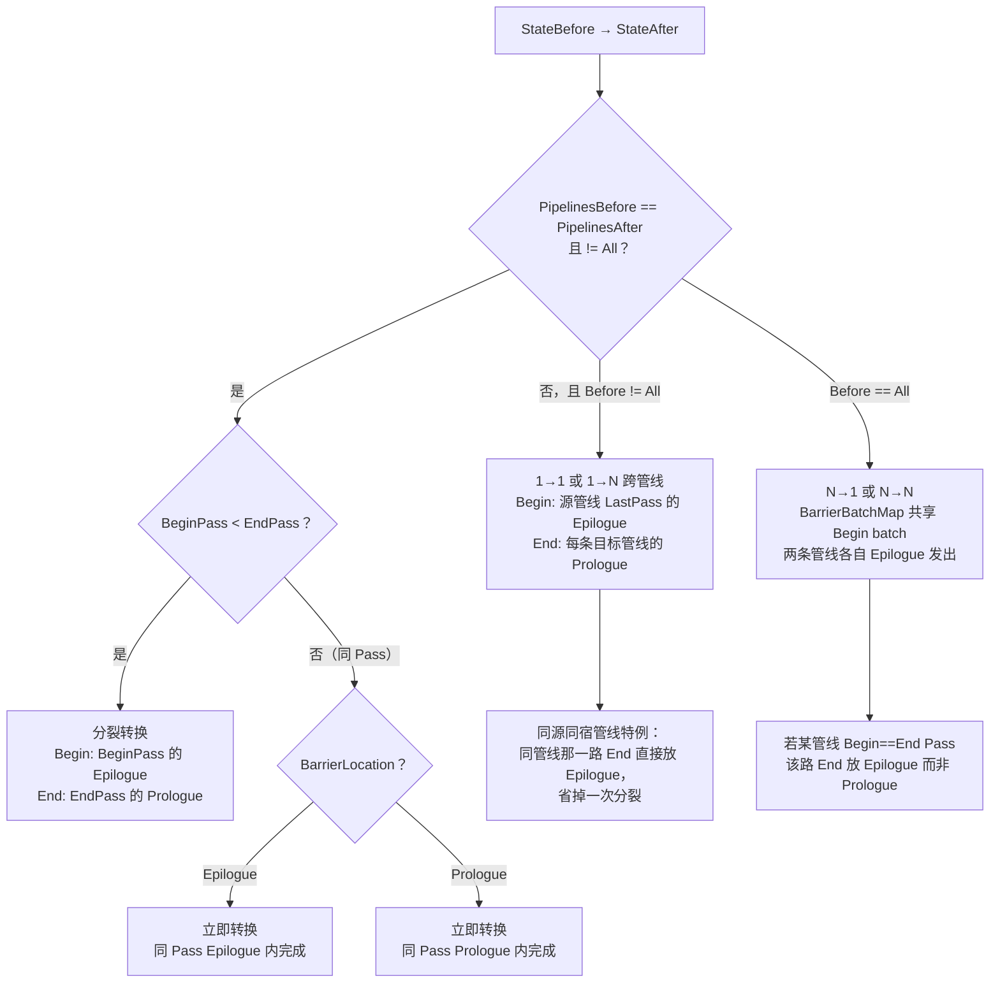
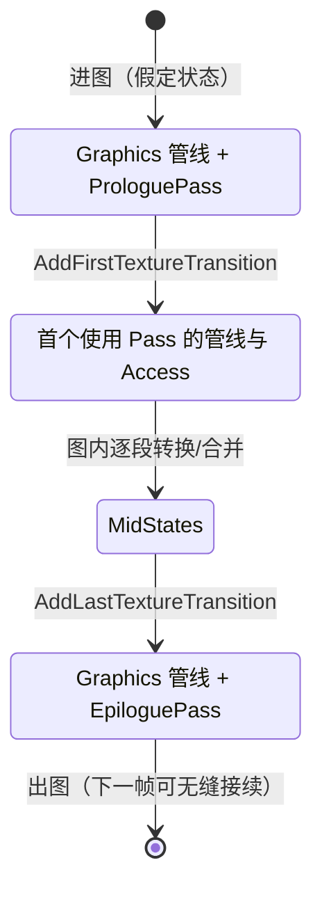
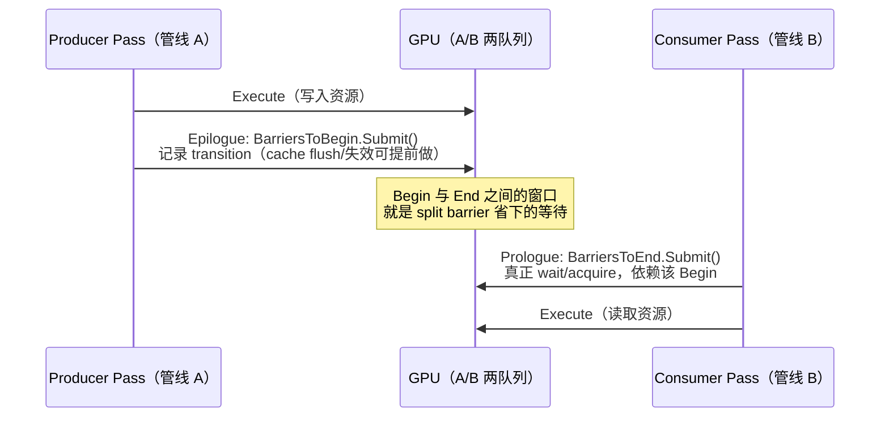
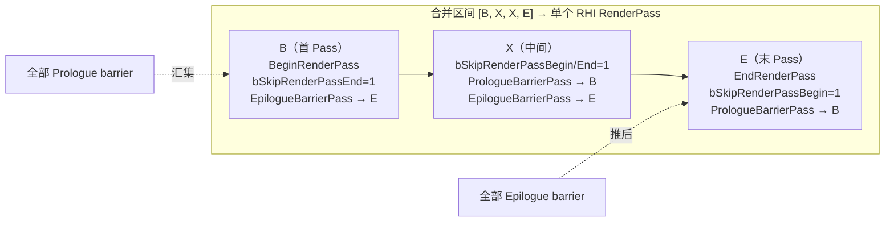
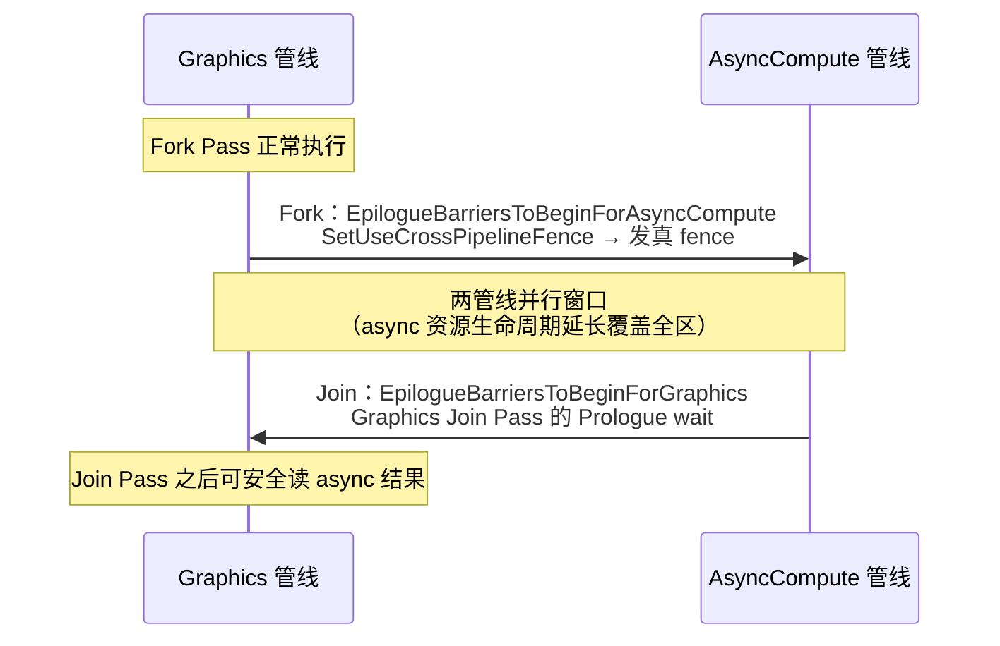

# 实时渲染系统 — UE RDG 屏障与同步机制源码解析

> 本文档是「实时渲染系统」系列文档的第 **15** 篇。基于 `Engine/Source/Runtime/RenderCore` 的 RDG 实现源码，逐函数拆解七个核心问题：**Pass 种类、Pass 所在 RHI 管线、资源声明、资源导入、资源状态转换、分裂屏障（Split Barrier）、屏障与 Pass 的关系（含 RenderPass 合并与 AsyncCompute Fork/Join）**。
>
> ⚠️ **阅读前置**：本文是 [13-UE5.8的RDG资源与RHI资源](13-UE5.8的RDG资源与RHI资源.md) 的源码级续篇，概念层（RDG 是什么、虚拟资源句柄）请先看 [06-FrameGraph帧图系统](06-FrameGraph帧图系统.md) 与 [07-RDG与FrameGraph概念辨析](07-RDG与FrameGraph概念辨析.md)；"Pass 是哪个层的 Pass" 的辨析见 [14-Pass概念分层解析](14-Pass概念分层解析.md)。**所有行号以引擎源码为准**（不同版本会漂移），函数名与逻辑结构是稳定的。

---

## 1. 全景：一次 RDG 执行发生什么

先把全链路放出来，后面每节都是这张图某一个节点的展开。



**一句话主线**：声明期把「管线」写进每个 subresource 的状态里 → 编译期按「Access / 管线集合 / Flags 三元组」判定相邻状态能否合并、是否需要 barrier → 把 barrier 拆成 Begin（生产者 Epilogue 发出）+ End（消费者 Prologue 完成）两半 → 执行期在 `SwitchPipeline` 之后按序提交。

---

## 2. Pass 的种类：ERDGPassFlags

### 2.1 标志定义

定义于 `Public/RenderGraphDefinitions.h`：

```cpp
// RenderGraphDefinitions.h
enum class ERDGPassFlags : uint16
{
    None = 0,

    // ---- 工作负载标志：决定跑在哪条 RHI 管线 ----
    Raster       = 1 << 0,   // 光栅化，只能在 Graphics 管线
    Compute      = 1 << 1,   // Compute，在 Graphics 管线（graphics queue 上的 dispatch）
    AsyncCompute = 1 << 2,   // Compute，在 AsyncCompute 管线
    Copy         = 1 << 3,   // 拷贝命令，在 Graphics 管线

    // ---- 行为标志：不改变管线归属 ----
    NeverCull      = 1 << 4, // 永不剔除（Readback 必带：写 staging，图追踪不到）
    SkipRenderPass = 1 << 5, // 用户自己 Begin/EndRenderPass，禁止 RenderPass 合并
    NeverMerge     = 1 << 6, // 禁止与邻接 Pass 合并（仅配合 Raster）
    NeverParallel  = 1 << 7, // 永不下放到任务线程

    Readback = Copy | NeverCull
};
```

### 2.2 两类标志的分工



### 2.3 合法性校验

`RenderGraphValidation.cpp` 中的硬约束：

```cpp
// RenderGraphValidation.cpp —— AddPass 时的 checkf 组
checkf(EnumHasAnyFlags(Flags, ERDGPassFlags::Raster | ERDGPassFlags::Compute
                     | ERDGPassFlags::AsyncCompute | ERDGPassFlags::Copy),
    TEXT("Pass %s must specify at least one of: (Copy, Compute, AsyncCompute, Raster)"));

checkf(!EnumHasAllFlags(Flags, ERDGPassFlags::Compute | ERDGPassFlags::AsyncCompute), ...);
checkf(!EnumHasAllFlags(Flags, ERDGPassFlags::Raster | ERDGPassFlags::AsyncCompute), ...);
checkf(!EnumHasAllFlags(Flags, ERDGPassFlags::SkipRenderPass) || EnumHasAllFlags(Flags, ERDGPassFlags::Raster), ...);
checkf(!EnumHasAllFlags(Flags, ERDGPassFlags::NeverMerge)     || EnumHasAllFlags(Flags, ERDGPassFlags::Raster), ...);
```

| 规则                                                | 说明                                     |
| --------------------------------------------------- | ---------------------------------------- |
| 至少一个负载标志                                    | `None` 只允许纯逻辑/参数传递 Pass      |
| `Compute` ⊥ `AsyncCompute`                     | 同一 Pass 不能同时在两条管线 dispatch    |
| `Raster` ⊥ `AsyncCompute`                      | 光栅化没有 async 队列概念                |
| `SkipRenderPass`/`NeverMerge` 必须配 `Raster` | 这两个标志只对 RHI RenderPass 合并有意义 |
| `Raster` 必须有 RT/DS 绑定                        | 否则要显式加`SkipRenderPass`           |

---

## 3. Pass 在哪条 RHI 管线

### 3.1 ERHIPipeline 是位掩码

```cpp
// RHI/Public/RHIPipeline.h
enum class ERHIPipeline : uint8
{
    Graphics     = 1 << 0,
    AsyncCompute = 1 << 1,

    None = 0,
    All  = Graphics | AsyncCompute,   // ⚠️ "同时被两条管线使用"是合法状态
    Num  = 2
};
```

⚠️ `All` 不是"随便一条"，而是 barrier 语义里的关键状态：**一个资源状态可以同时覆盖两条管线**（见 [§6](#6-资源如何转换完整状态机) 的 `GetPipelines()`）。

### 3.2 唯一映射点



```cpp
// RenderGraphPass.cpp —— FRDGPass 构造函数，全引擎唯一映射点
FRDGPass::FRDGPass(...)
    : Name(...), Flags(InFlags), ...
    , Pipeline(EnumHasAnyFlags(Flags, ERDGPassFlags::AsyncCompute)
               ? ERHIPipeline::AsyncCompute : ERHIPipeline::Graphics)
{}
```

> **结论：一条 Pass 只属于一条管线，且完全由 `AsyncCompute` 标志决定。** `Compute` 与 `Raster` 虽然负载不同，但都在 Graphics 管线。

### 3.3 平台降级：AsyncCompute 不一定真跑 Async

```cpp
// RenderGraphPrivate.h
FORCEINLINE bool IsAsyncComputeSupported(EShaderPlatform ShaderPlatform)
{
    // Render pass merging and async compute are mutually exclusive ...
    return GRDGAsyncCompute > 0 && !IsImmediateMode()
        && !IsRenderPassMergeEnabled(ShaderPlatform)          // ⚠️ RenderPass 合并与 AsyncCompute 互斥
        && GSupportsEfficientAsyncCompute
        && GRHISupportsSeparateDepthStencilCopyAccess;
}
```

| 场景                                | 行为                                                    | 代码位置                                                                                          |
| ----------------------------------- | ------------------------------------------------------- | ------------------------------------------------------------------------------------------------- |
| 平台不支持 AsyncCompute             | External Access 的`Pipelines` 强制收敛为 `Graphics` | `RenderGraphBuilder.cpp`（`if (!bSupportsAsyncCompute) Pipelines = ERHIPipeline::Graphics;`） |
| `r.RDG.AsyncCompute = 2`（Force） | `Compute` 被**偷偷改写**为 `AsyncCompute`     | `RenderGraphBuilder.cpp` AddPass 路径                                                           |
| Tiled GPU（开启 RenderPass 合并）   | AsyncCompute 整体关闭                                   | `IsAsyncComputeSupported` 返回 false                                                            |

### 3.4 提交到 RHI

```cpp
// RenderGraphBuilder.cpp
void FRDGBuilder::ExecutePass(FRHIComputeCommandList& RHICmdListPass, FRDGPass* Pass)
{
    SCOPED_GPU_MASK(RHICmdListPass, Pass->GPUMask);
    RHICmdListPass.SwitchPipeline(Pass->Pipeline);   // ★ 先切管线

    ExecutePassPrologue(RHICmdListPass, Pass);       //   barrier End / BeginRenderPass
    Pass->Execute(RHICmdListPass);                   //   用户 lambda
    ExecutePassEpilogue(RHICmdListPass, Pass);       //   barrier Begin / EndRenderPass
}
```

⚠️ **关键不变式：所有 transition / fence 都必须在 `SwitchPipeline` 之后、在该 Pass 所属管线的 command list 里发出。**

---

## 4. Pass 如何声明资源

### 4.1 参数类型 → ERHIAccess 推导表

Pass 参数结构体由 `FRDGParameterStruct` 遍历，每个 member 类型对应一种访问推导：

| 参数类型                              | 推得的`ERHIAccess`                                                        | 子资源范围                  |
| ------------------------------------- | --------------------------------------------------------------------------- | --------------------------- |
| `RDG_TEXTURE` / `RDG_TEXTURE_SRV` | `SRVAccess`（按 pass flags 推导）                                         | SRV 范围                    |
| `RDG_TEXTURE_NON_PIXEL_SRV`         | `SRVAccess`（保留 NonPixel 位）                                           | SRV 范围                    |
| `RDG_TEXTURE_UAV`                   | `UAVAccess`                                                               | UAV 范围                    |
| `RDG_TEXTURE_ACCESS` / `_ARRAY`   | **用户显式指定** `ERHIAccess`                                       | 用户显式指定 Range          |
| `RENDER_TARGET_BINDING_SLOTS`       | `RTV` / `ResolveDst` / Depth\|Stencil 拆分                              | 按 mip/slice/plane 精确定界 |
| Buffer 的 SRV/UAV/ACCESS              | `SRVAccess`/`UAVAccess`；`BUF_AccelerationStructure` 追加 `BVHRead` | 整体                        |

### 4.2 SRV/UAV access 由 Pass Flags 决定

```cpp
// RenderGraphBuilder.cpp
inline void GetPassAccess(ERDGPassFlags PassFlags, ERHIAccess& SRVAccess, ERHIAccess& UAVAccess)
{
    SRVAccess = ERHIAccess::Unknown;
    UAVAccess = ERHIAccess::Unknown;

    if (EnumHasAnyFlags(PassFlags, ERDGPassFlags::Raster))
    {
        SRVAccess |= ERHIAccess::SRVGraphics;
        UAVAccess |= ERHIAccess::UAVGraphics;
    }
    if (EnumHasAnyFlags(PassFlags, ERDGPassFlags::AsyncCompute | ERDGPassFlags::Compute))
    {
        SRVAccess |= ERHIAccess::SRVCompute;
        UAVAccess |= ERHIAccess::UAVCompute;
    }
    if (EnumHasAnyFlags(PassFlags, ERDGPassFlags::Copy))
    {
        SRVAccess |= ERHIAccess::CopySrc;
    }
}
```

> **重要推论**：同样语义是"读纹理"，`Compute` pass 产生 `SRVCompute`，`Raster` pass 产生 `SRVGraphics` —— **这本身就是一次状态差，会产生 barrier**。RDG 不识别"逻辑上都是读"，只认 access 位。

### 4.3 声明落到 FRDGSubresourceState



```cpp
// RenderGraphBuilder.cpp —— 同一 Pass 内多次引用的 access 合并
inline ERHIAccess MakeValidAccess(ERHIAccess AccessOld, ERHIAccess AccessNew)
{
    const ERHIAccess AccessUnion = AccessOld | AccessNew;
    const ERHIAccess NonMergeableAccessMask = ~GRHIMergeableAccessMask;
    if (!EnumHasAnyFlags(AccessUnion, NonMergeableAccessMask))
    {
        // 可写时剥掉 ReadOnlyExclusive 位（读写并存以写为准）
        return IsWritableAccess(AccessUnion) ? (AccessUnion & ~ERHIAccess::ReadOnlyExclusiveMask) : AccessUnion;
    }
    ... // 不可合并时保留旧值
}
```

最终落在 `Pass->TextureStates` / `Pass->BufferStates`。**`State->SetPass(PassPipeline, PassHandle)` 是整个 RDG 同步体系的原子操作**——它只写 `FirstPass/LastPass[PassPipeline]` 那一路（见 `RenderGraphResources.inl`），这正是跨管线 barrier 能推导出来的原因。

---

## 5. 资源如何"导入"RDG

| 途径                   | API                                                                                        | RDG 侧含义                                                    |
| ---------------------- | ------------------------------------------------------------------------------------------ | ------------------------------------------------------------- |
| **外部注册**     | `RegisterExternalTexture(IPooledRenderTarget*, Flags)` / `RegisterExternalBuffer`      | `bExternal = true`，已有 RHI 资源，RDG 只接管状态追踪与转换 |
| **图内创建**     | `CreateTexture` / `CreateBuffer`                                                       | `bExternal = false`，RDG 延迟分配（池化或 transient 别名）  |
| **导出回外部**   | `ConvertToExternalTexture/Buffer`、`QueueTextureExtraction`                            | 转成 CullRoot，生命周期延长到图的 Epilogue                    |
| **上传**         | `CreateBuffer(..., InitialData)`                                                         | `bQueuedForUpload`，内部生成一个 copy/upload pass           |
| **外部托管访问** | `UseExternalAccessMode(Resource, ReadOnlyAccess, Pipelines)` / `UseInternalAccessMode` | 挂起 RDG 追踪，交回 RHI 直接访问                              |

### 5.1 外部注册的去重

```cpp
// RenderGraphBuilder.cpp
FRDGTexture* FRDGBuilder::RegisterExternalTexture(...)
{
    if (FRDGTexture* FoundTexture = FindExternalTexture(ExternalTextureRHI))
    {
        return FoundTexture;   // ⚠️ 同一个 RHI 资源去重：一条 RDG 资源只对应一个 RHI 资源
    }
    ...
    Texture->bExternal = true;
    ExternalTextures.FindOrAdd(Texture->GetRHIUnchecked(), Texture);
}
```

`bExternal` 影响两件事：是否参与转换（参与），以及底层显存是否可被 transient 分配器别名（不可）。

### 5.2 外部访问模式的实现

`UseExternalAccessMode` 会按管线创建一组特殊的 **AccessModePass**：

```cpp
// RenderGraphBuilder.cpp —— 每条目标管线一个 LambdaPass
FRDGPass* Pass = Passes.Allocate<LambdaPassType>(Allocators.Root,
    RDG_EVENT_NAME("AccessModePass[Graphics] ..."),
    FAccessModePassParameters::FTypeInfo::GetStructMetadata(), Parameters,
    // ⚠️ 带上全部负载标志，使任何 access 都合法
    ERDGPassFlags::Copy | ERDGPassFlags::Compute | ERDGPassFlags::Raster
  | ERDGPassFlags::SkipRenderPass | ERDGPassFlags::NeverCull,
    MoveTemp(ExecuteLambda));
Pass->ExternalAccessOps = MoveTemp(Ops);
Pass->bExternalAccessPass = 1;
```

进入 external 的 Pass 里 SRV 参数必须用 `RDG_TEXTURE_ACCESS` / `RDG_BUFFER_ACCESS` **显式指定** access，这样才能同时兼容 Graphics / AsyncCompute 两种 Filter Mask（`ReadOnlyExclusiveMask` vs `ReadOnlyExclusiveComputeMask`）。

---

## 6. 资源如何转换：完整状态机

### 6.1 状态单元 FRDGSubresourceState

```cpp
// Public/RenderGraphResources.h
struct FRDGSubresourceState
{
    static bool IsTransitionRequired(const FRDGSubresourceState& Previous, const FRDGSubresourceState& Next);
    static bool IsMergeAllowed(ERDGViewableResourceType, const FRDGSubresourceState& Previous, const FRDGSubresourceState& Next);

    ERHIAccess Access = ERHIAccess::Unknown;

    /** 这段状态在每条管线上覆盖的首/末 Pass —— 按管线各存一份！ */
    FRDGPassHandlesByPipeline FirstPass;   // TRHIPipelineArray<FRDGPassHandle>
    FRDGPassHandlesByPipeline LastPass;

    FRDGViewUniqueFilter NoUAVBarrierFilter;
    EResourceTransitionFlags Flags = EResourceTransitionFlags::None;

    /** 同 Pass 同管线时的落点选择 */
    ERDGBarrierLocation BarrierLocation = ERDGBarrierLocation::Prologue;
};
```

```cpp
// RenderGraphResources.inl —— 这段状态"覆盖的管线集合"
inline ERHIPipeline FRDGSubresourceState::GetPipelines() const
{
    ERHIPipeline Pipelines = ERHIPipeline::None;
    Pipelines |= FirstPass[ERHIPipeline::Graphics].IsValid()     ? ERHIPipeline::Graphics     : ERHIPipeline::None;
    Pipelines |= FirstPass[ERHIPipeline::AsyncCompute].IsValid() ? ERHIPipeline::AsyncCompute : ERHIPipeline::None;
    return Pipelines;   // Graphics / AsyncCompute / All 三态之一
}
```

> **心智模型**：一段 subresource 状态 = `Access` × `覆盖的管线集合` × `Flags`。三者任一变化，都是一次潜在 barrier。

### 6.2 转换流水线三阶段



### 6.3 IsMergeAllowed：什么时候不需要 barrier

```cpp
// RenderGraphResources.cpp
bool FRDGSubresourceState::IsMergeAllowed(...)
{
    const ERHIAccess AccessUnion = Previous.Access | Next.Access;

    // 只读态 与 可写态 不能合并
    if (EnumHasAnyFlags(Previous.Access, ERHIAccess::ReadOnlyExclusiveMask)
     && EnumHasAnyFlags(Next.Access, ERHIAccess::WritableMask)) return false;
    // 写独占态 与 可读态 不能合并
    if (EnumHasAnyFlags(Previous.Access, ERHIAccess::WriteOnlyExclusiveMask)
     && EnumHasAnyFlags(Next.Access, ERHIAccess::ReadableMask)) return false;
    // UAV 只能和 UAV 自己合并（UAV 同时是读和写）
    if (EnumHasAnyFlags(AccessUnion, ERHIAccess::UAVMask)
     && EnumHasAnyFlags(AccessUnion, ~ERHIAccess::UAVMask)) return false;
    // Depth Read/Write 只能和自己合并
    if (EnumHasAllFlags(AccessUnion, DSVMask)
     && EnumHasAnyFlags(AccessUnion, ~DSVMask)) return false;
    // 平台不支持的合并态
    if (EnumHasAnyFlags(AccessUnion, ~GRHIMergeableAccessMask)) return false;
    // ★ 跨管线合并：access 必须在多管线可合并白名单内
    if (EnumHasAnyFlags(AccessUnion, ~GRHIMultiPipelineMergeableAccessMask)
     && Previous.GetPipelines() != Next.GetPipelines()) return false;
    // TransitionFlags 不同不能合并
    if (Previous.Flags != Next.Flags) return false;
    return true;
}
```

| 禁止合并的组合            | 原因                             |
| ------------------------- | -------------------------------- |
| 只读 × 可写              | 读写 hazard                      |
| 写独占 × 可读            | WAR hazard                       |
| UAV × 非 UAV             | UAV 读写同体，只许自我合并       |
| DSV × 非 DSV             | 深度状态独立管理                 |
| 跨管线 × 非白名单 access | **必然产生跨管线 barrier** |

### 6.4 IsTransitionRequired：什么时候需要 barrier

```cpp
// RenderGraphResources.cpp
bool FRDGSubresourceState::IsTransitionRequired(const FRDGSubresourceState& Previous, const FRDGSubresourceState& Next)
{
    if (Previous.Access != Next.Access
     || Previous.GetPipelines() != Next.GetPipelines()   // ★ 管线集合变了也要 barrier
     || Previous.Flags != Next.Flags)
    {
        return true;
    }
    // ⚠️ UAV→UAV 即使状态完全相同，也可能要 barrier（执行序保证）
    if (EnumHasAnyFlags(Next.Access, ERHIAccess::UAVMask) && !SkipUAVBarrier(Previous, Next))
    {
        return true;
    }
    return false;
}
```

**判定速记**：`Access 变 ‖ 管线集合变 ‖ Flags 变 → barrier`；外加 `UAV→UAV 默认要 barrier`，唯一豁免是前后引用**同一个**带 `ERDGUnorderedAccessViewFlags::SkipBarrier` 的 UAV 句柄（`RenderGraphPrivate.h` 的 `SkipUAVBarrier`）。

### 6.5 AddTransition：三分支决策树（本篇核心）



对应源码三段（`RenderGraphBuilder.cpp`）：

```cpp
// ── 分支1：1-to-1 同管线 ──
if (PipelinesBefore == PipelinesAfter && PipelinesAfter != ERHIPipeline::All)
{
    const FRDGPassHandle BeginPassHandle = StateBefore.LastPass[PipelinesAfter];
    const FRDGPassHandle EndPassHandle   = StateAfter.FirstPass[PipelinesAfter];

    if (BeginPassHandle < EndPassHandle)
    {
        // ★ 分裂：从 begin pass 的 epilogue 拆到 end pass 的 prologue
        FRDGPass* BeginPass = GetEpilogueBarrierPass(BeginPassHandle);
        FRDGBarrierBatchBegin* BarriersToBegin =
            &BeginPass->GetEpilogueBarriersToBeginFor(Allocators.Transition, TransitionCreateQueue, PipelinesAfter);
        BarriersToBegin->AddTransition(Resource, TransitionInfo);
        AddToPrologueBarriersToEnd(EndPassHandle, *BarriersToBegin);
    }
    else if (StateAfter.BarrierLocation == ERDGBarrierLocation::Epilogue) { /* 同 Pass epilogue 立即完成 */ }
    else                                                                  { /* 同 Pass prologue 立即完成 */ }
}
// ── 分支2：1-to-1 / 1-to-N 跨管线 ──
else if (PipelinesBefore != ERHIPipeline::All)
{
    // Begin 永远落在源管线最后使用者的 Epilogue
    // End 落在每条目标管线的 Prologue；同管线特例直接 End 在 Epilogue（省一次 split）
}
// ── 分支3：N-to-1 / N-to-N（Before == All）──
else
{
    // BarrierBatchMap 按 (两条管线各自的 Epilogue Pass) 做 key 共享 batch
    // 两条管线的 begin pass 各持 SharedEpilogueBarriersToBegin
}
```

### 6.6 首尾两个强制转换



```cpp
// RenderGraphBuilder.cpp —— AddFirstTextureTransition 要点
FRDGSubresourceState& SubresourceStateBefore =
    *AllocSubresource(FRDGSubresourceState(ERHIPipeline::Graphics, GetProloguePassHandle()));

if (Texture->AcquirePass.IsValid())          // transient 别名：先 Acquire
{
    AddAliasingTransition(Texture->AcquirePass, Texture->FirstPass, Texture, FRHITransientAliasingInfo::Acquire(...));
    SubresourceStateBefore.Access = ERHIAccess::Discard;
}
else if (!Texture->bSplitFirstTransition)    // 不分裂：直接假定状态在首 Pass
{
    SubresourceStateBefore.SetPass(GetPassPipeline(Texture->FirstPass), Texture->FirstPass);
}

// AddLastTextureTransition：统一收敛回 Graphics + EpiloguePass
SubresourceStateAfter.SetPass(ERHIPipeline::Graphics, GetEpiloguePassHandle());
```

**为什么首尾都收敛到 Graphics**：帧与帧之间、图与图之间没有显式握手，统一以 "Graphics 管线 + 哨兵 Pass" 作为假定状态，下一帧的第一个转换才能闭合并接。

---

## 7. 分裂屏障（Split Barrier）

### 7.1 Begin/End 双 Batch 结构

```cpp
// Public/RenderGraphPass.h
class FRDGBarrierBatchBegin
{
    void SetUseCrossPipelineFence(bool bUseSeparateTransition)
    {
        if (bUseSeparateTransition) { bSeparateFenceTransitionNeeded = true; }
        else { EnumRemoveFlags(TransitionFlags, ERHITransitionCreateFlags::NoFence); } // ★ 移除 NoFence → 发真 fence
        bTransitionNeeded = true;
    }
private:
    const FRHITransition* Transition = nullptr;
    TRHIPipelineArray<FRDGBarrierBatchEndId> BarriersToEnd;   // 一个 Begin 可被多条管线的 End 依赖
    ERHITransitionCreateFlags TransitionFlags =
        ERHITransitionCreateFlags::NoFence                    // 默认不发跨管线 fence，只做"分裂"
      | ERHITransitionCreateFlags::AllowDecayPipelines;
    ERHIPipeline PipelinesToBegin;   // 发出方管线（= Begin Pass 的 Pipeline）
    ERHIPipeline PipelinesToEnd;     // 结束方管线（Graphics / AsyncCompute / All）
};

class FRDGBarrierBatchEnd
{
    /** 一个 Begin batch 可被多个 End batch 依赖（1→N） */
    void AddDependency(FRDGBarrierBatchBegin* BeginBatch);
};
```

### 7.2 分裂的物理时序



### 7.3 每个 Pass 的 barrier 槽位

```cpp
// Public/RenderGraphPass.h —— FRDGPass 的 7 个槽位
FRDGBarrierBatchBegin* PrologueBarriersToBegin = nullptr;              // 本 Pass Prologue 发出的 Begin
FRDGBarrierBatchEnd*   PrologueBarriersToEnd = nullptr;                // 本 Pass Prologue 完成的 End
FRDGBarrierBatchBegin* EpilogueBarriersToBeginForGraphics = nullptr;   // End 方是 Graphics
FRDGBarrierBatchBegin* EpilogueBarriersToBeginForAsyncCompute = nullptr;// End 方是 AsyncCompute
FRDGBarrierBatchBegin* EpilogueBarriersToBeginForAll = nullptr;        // End 方是两条管线
TArray<FRDGBarrierBatchBegin*> SharedEpilogueBarriersToBegin;          // N 路 join 共享 batch
FRDGBarrierBatchEnd*   EpilogueBarriersToEnd = nullptr;
```

```cpp
// RenderGraphPass.cpp —— 构造时：PipelinesToBegin = 本 Pass 管线，PipelinesToEnd = 目标管线
GetPrologueBarriersToBegin(...)          // new FRDGBarrierBatchBegin(Pipeline, Pipeline, ...)
GetEpilogueBarriersToBeginForGraphics    // new FRDGBarrierBatchBegin(Pipeline, ERHIPipeline::Graphics, ...)
GetEpilogueBarriersToBeginForAsyncCompute// new FRDGBarrierBatchBegin(Pipeline, ERHIPipeline::AsyncCompute, ...)
GetEpilogueBarriersToBeginForAll         // new FRDGBarrierBatchBegin(Pipeline, ERHIPipeline::All, ...)
```

### 7.4 执行顺序：Prologue/Epilogue 内谁先谁后

```cpp
// RenderGraphBuilder.cpp —— ExecutePassPrologue（顺序即语义）
if (Pass->PrologueBarriersToBegin) { ...Submit... }              // 1. 本 Pass 要发出的 Begin
if (Pass->PrologueBarriersToEnd)   { ...Submit... }              // 2. 落到本 Pass 的 End
if (EnumHasAnyFlags(PassFlags, ERDGPassFlags::Raster)) { /* BeginRenderPass */ }
BeginUAVOverlap(Pass, RHICmdListPass);
```

```cpp
// RenderGraphBuilder.cpp —— ExecutePassEpilogue
EndUAVOverlap(...);
if (Raster) { EndRenderPass(); }                                 // ⚠️ 必须先 EndRenderPass：
                                                                 //    RenderPass 内不能插 barrier
// 3 个 EpilogueBarriersToBegin* + Shared 逐个 Submit，收集到 Transitions
if (!Transitions.IsEmpty()) { RHICmdListPass.BeginTransitions(Transitions); }
if (Pass->EpilogueBarriersToEnd) { ...Submit... }                // 最后才 End 落在本 Pass 的 barrier
```

### 7.5 首屏障是否分裂：bSplitFirstTransition

```cpp
// RenderGraphResources.cpp —— 构造时的默认值（注意逻辑是"非"）
bSplitFirstTransition = !EnumHasAnyFlags(InFlags, ERDGTextureFlags::ForceImmediateFirstBarrier)
                     && !EnumHasAnyFlags(InDesc.Flags, ETextureCreateFlags::Presentable);
```

| `bSplitFirstTransition` | 触发条件                                          | 行为                                                                                                                                    |
| ------------------------- | ------------------------------------------------- | --------------------------------------------------------------------------------------------------------------------------------------- |
| `true`（默认）          | 普通纹理                                          | StateBefore 停在 ProloguePass/Graphics → Begin < End →**分裂**（Begin 在 Prologue 哨兵 epilogue，End 在首个使用 Pass prologue） |
| `false`                 | `ForceImmediateFirstBarrier` 或 `Presentable` | StateBefore 直接设在首 Pass → Begin == End →**不分裂**，首 Pass prologue 立即完成                                               |

> ⚠️ **注释陷阱**：`RenderGraphResources.h` 里该字段的注释措辞（"skip the first split barrier"）与代码语义相反。**以代码分支为准：flag 为 true 才是"做分裂"**。`Presentable`（后备缓冲）强制不分裂，因为 swapchain 语义要求尽早完成。

---

## 8. 屏障与 Pass 的关系

### 8.1 间接层：PrologueBarrierPass / EpilogueBarrierPass

每个 Pass 有两个"代理句柄"，默认指向自己：

```cpp
// RenderGraphBuilder.cpp —— SetupPassInternals
Pass->PrologueBarrierPass = PassHandle;
Pass->EpilogueBarrierPass = PassHandle;
```

```cpp
// Public/RenderGraphBuilder.h —— 为什么需要这层间接（头文件注释，值得背诵）
/** Prologue and Epilogue barrier passes are used to plan transitions around
 *  RHI render pass merging, as it is illegal to issue a barrier during a render pass.
 *  If passes [A, B, C] are merged together, 'A' becomes 'B's prologue pass
 *  and 'C' becomes 'A's epilogue pass. ... */
FRDGPass* GetEpilogueBarrierPass(FRDGPassHandle Handle) { return Passes[GetEpilogueBarrierPassHandle(Handle)]; }
FRDGPass* GetPrologueBarrierPass(FRDGPassHandle Handle) { return Passes[GetPrologueBarrierPassHandle(Handle)]; }
```

> **所有 barrier 的 Begin/End 落点都经过「逻辑 Pass → 代理 Pass」解析**。这层抽象就是为 RenderPass 合并准备的。

### 8.2 RenderPass 合并如何重定向屏障



```cpp
// RenderGraphBuilder.cpp —— MergeRenderPasses 的重定向三段
// (B) 首 Pass
Pass->bSkipRenderPassEnd = 1;
SetEpilogueBarrierPass(Pass, LastPassHandle);
// (X) 中间 Pass
Pass->bSkipRenderPassBegin = 1;  Pass->bSkipRenderPassEnd = 1;
SetPrologueBarrierPass(Pass, FirstPassHandle);
SetEpilogueBarrierPass(Pass, LastPassHandle);
// (E) 末 Pass
Pass->bSkipRenderPassBegin = 1;
SetPrologueBarrierPass(Pass, FirstPassHandle);
```

**效果：整个合并区间的所有 prologue barrier 提到首 Pass 之前，所有 epilogue barrier 推到末 Pass 之后 —— RenderPass 内部零 barrier。**

合并准入条件：

```cpp
// RenderGraphBuilder.cpp
if (EnumHasAnyFlags(NextPass->Flags, ERDGPassFlags::SkipRenderPass | ERDGPassFlags::NeverMerge))
    { CommitMerge(); continue; }          // 用户自管 RenderPass 或禁合并
if (!NextPass->bRenderPassOnlyWrites)
    { CommitMerge(); continue; }          // ⚠️ 有 UAV 写 → 引入 RenderPass 外依赖，不能合并
```

`bRenderPassOnlyWrites` 在 `SetupPassResources` 里计算：**所有写必须都是 RT/DS；任何 UAV 写都会置 false**。

### 8.3 跨管线依赖：AsyncCompute 的 Fork / Join

跨管线 producer/consumer 边在依赖建立阶段累积：

```cpp
// RenderGraphBuilder.cpp —— SetupPassDependencies
if (Producer->Pipeline != Consumer->Pipeline)
{
    BinarySearchOrAdd(Producer->CrossPipelineConsumers, Consumer->Handle);
    // consumer 记录对侧管线上"最新的"producer
    if (Consumer->CrossPipelineProducer.IsNull() || Producer->Handle > Consumer->CrossPipelineProducer)
        Consumer->CrossPipelineProducer = Producer->Handle;
}
```



```cpp
// RenderGraphBuilder.cpp —— Fork（Graphics → AsyncCompute）
FRDGBarrierBatchBegin& EpilogueBarriersToBeginForAsyncCompute =
    GraphicsForkPass->GetEpilogueBarriersToBeginForAsyncCompute(...);
GraphicsForkPass->bGraphicsFork = 1;
EpilogueBarriersToBeginForAsyncCompute.SetUseCrossPipelineFence(bSeparateTransitionNeeded); // ★ 真 fence
AsyncComputePass->bAsyncComputeBegin = 1;
AsyncComputePass->GetPrologueBarriersToEnd(...).AddDependency(&EpilogueBarriersToBeginForAsyncCompute);

// Join（AsyncCompute → Graphics）镜像对称：
// AsyncComputePass->GetEpilogueBarriersToBeginForGraphics(...).SetUseCrossPipelineFence(false)
// GraphicsJoinPass->GetPrologueBarriersToEnd(...).AddDependency(...)
```

⚠️ **fork/join 同时承担资源生命周期延长**：

```cpp
// RenderGraphBuilder.cpp —— 两条管线并行期间，async pass 不能提前分配/释放资源
// "all resource lifetimes on async compute are extended to cover the full async region."
AsyncComputePass->ResourcesToBegin.Reset();
Passes[GraphicsForkPass->PrologueBarrierPass]->ResourcesToBegin.Add(AsyncComputePass);
```

---

## 9. 核心速查表

| 问题                         | 答案（代码依据）                                                                                                                                              |
| ---------------------------- | ------------------------------------------------------------------------------------------------------------------------------------------------------------- |
| Pass 在哪条管线              | 只由`AsyncCompute` flag 决定（`FRDGPass` 构造函数）；`Raster/Compute/Copy` 全是 Graphics                                                                |
| 资源在哪些管线被用过         | `FRDGSubresourceState::GetPipelines()`：两路 `FirstPass` 有效位的或                                                                                       |
| 什么时候需要 barrier         | `Access` 变 ‖ `GetPipelines()` 变 ‖ `Flags` 变 ‖ UAV→UAV（非同一 SkipBarrier UAV）                                                                  |
| 什么时候能合并状态           | 只读/可写不混、UAV 只合 UAV、DSV 只合自己、跨管线要求 access 在`GRHIMultiPipelineMergeableAccessMask` 内                                                    |
| Begin 落在哪                 | 发起方 Pass 的**Epilogue**（`GetEpilogueBarriersToBeginFor{Graphics,AsyncCompute,All}`）                                                              |
| End 落在哪                   | 接收方 Pass 的**Prologue**；同 Pass 退化为 Epilogue（由 `BarrierLocation` 决定）                                                                      |
| RenderPass 内能有 barrier 吗 | 不能——靠`Prologue/EpilogueBarrierPass` 重定向到合并区间首尾                                                                                               |
| 什么时候分裂                 | `BeginPassHandle < EndPassHandle`；相等则立即转换                                                                                                           |
| 谁发跨管线 fence             | `SetUseCrossPipelineFence` 移除 `NoFence`；Fork 在 GraphicsPass 的 `Epilogue...ForAsyncCompute`，Join 在 AsyncComputePass 的 `Epilogue...ForGraphics` |
| 首转换分裂与否               | `bSplitFirstTransition` 默认 true 分裂；`ForceImmediateFirstBarrier`/`Presentable` 不分裂                                                               |
| 尾转换                       | 统一收敛`Graphics + EpiloguePass`，保证跨帧接续                                                                                                             |
| AsyncCompute 平台条件        | `GRDGAsyncCompute>0` 且非 Immediate 且**未开 RenderPass 合并**且硬件支持                                                                              |

**调试手段**：`r.RDG.Debug=1` / `r.RDG.TransitionLog=1`（`RenderGraphPrivate.h`），配合 Batch 名称（`"Prologue"` / `"Epilogue (For Graphics)"` / `"Epilogue (For AsyncCompute)"` / `"Epilogue (For All)"`）在 RenderDoc / RDG Insight 中定位每一组屏障。

---

## 10. 小结

| 要点                                | 说明                                                           |
| ----------------------------------- | -------------------------------------------------------------- |
| 一条 Pass 一条管线                  | 仅由`AsyncCompute` 标志决定，构造函数内一次成型              |
| 管线写进资源状态                    | `SetPass(PassPipeline, PassHandle)` 是同步推导的原子操作     |
| 状态三元组                          | `Access × 管线集合 × Flags`，任一变化即潜在 barrier        |
| 合并先行                            | `IsMergeAllowed` 先消冗余（read→read 等），再做转换判定     |
| UAV 特殊                            | 状态相同也可能要 barrier；仅同一 SkipBarrier UAV 豁免          |
| 分裂是常态                          | Begin 在生产者 Epilogue、End 在消费者 Prologue；同 Pass 才立即 |
| 默认不发 fence                      | `NoFence` 是默认值，仅 fork/join 显式移除                    |
| RenderPass 内零 barrier             | 代理 Pass 重定向 + 合并区间首尾集中收发                        |
| AsyncCompute 与 RenderPass 合并互斥 | Tiled GPU 平台上 AsyncCompute 自动关闭                         |
| 跨帧接续靠收敛                      | 首/尾强制转换都以 Graphics + 哨兵 Pass 为锚点                  |
| 注释不可尽信                        | `bSplitFirstTransition` 注释与代码语义相反，以分支为准       |

> 一句话收尾：**RDG 的同步不是"插 barrier"，而是「把管线归属写进资源状态 → 按三元组比较相邻状态 → 把必需的转换拆成 Begin/End 两半、贴到合并/跨管线约束允许的位置上」**。理解了 `SetPass` + `IsMergeAllowed` + `AddTransition` 这三个点，整套机制就通了。

---

*上一篇：[14-Pass概念分层解析](14-Pass概念分层解析.md) | 返回总览：[00-总览与架构概览](00-总览与架构概览.md)*
